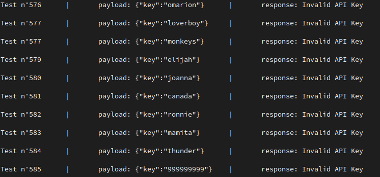

# GO GM v1.0

GO GM is a tool used to brute-force API's request:

1. ... Brut force with a different payload (POST)
1. ... Easy to use
1. ... Use concurency
1. ... Work in command line
1. ... Faster that some random script in Python

## How to install it ?

```bash
    git clone https://github.com/gmorinn/go-hack && cd go-hack && make re &&
    ./go-gm {...flags}
```

## How to use it ?

```bash
-u, --url			    {URL_API} Url of the API
-t, --threads			{THREADS} Number of concurrent threads (default=3)
-w, --wordlist			{WORDLIST} Path to the wordlist
-m, --method			{METHOD} Method of the request. Default=POST
-p, --payload			{PAYLOAD} The attribute you want to modify. Example: -p email -w email.txt
-l, --limit			    {LIMIT} Stop the program when the number of request equals ${limit}
-gp, --general-payload	{GENERAL_PAYLOAD} The payload that does not change with each request. Exemple: -gp "{\"email\":\"guillaume@test.com\"}"
-r, --response			{RESPONSE} Corresponds to the response or message returned by the API. If the response of the request contains the response specified then the program stops. Example: -r "{"success":"true"}"
-n, --not			    {NOT} Stop the program when the request send a response different of the -r specified. Exemple: -r "INVALD API KEY" -n => The program stop when the response is different that "INVALID API KEY"
```

### NOTICE
- Only one url is taken into account.
- Only one attribute is possible in the payload for version 1.
- All flags are not mandatory, except -u && -w && (-r || -l)
- You can stop the program at any moment with CRTL + C

## Example

- Find the API Key when the response of the request is different from "invalid api key"
```bash
./go-gm -u http://10.10.79.77:8081/api/guillaume -p key -w keywordlist.txt -r "Invalid API Key" --not
```

-  Find the password of a user and when the response contains "{"success":"true"}"
```bash
 ./go-gm -u http://10.10.159.167:8081/sign -p password -w password.txt -m POST -r "{\"success\":\"true\"}" --general-payload "{\"email\":\"guillaume@test.com\"}"
 ```


 